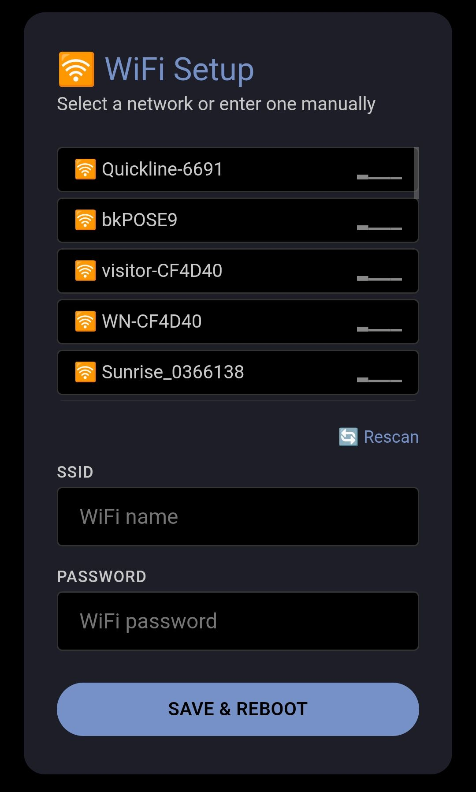

# WiFi Manager for MicroPython
<a href="https://www.buymeacoffee.com/ch570512" target="_blank"></a>

This is an easy to use WiFi-Manager for MicroPython. Even the '_callback' is optional.

Flow on boot:
1. Try to connect using saved (not encrypted) credentials from _CONFIG_FILE
2. If connected → return WLAN interface to caller
3. If no saved credentials or connection fails:
   - Start an Access Point _AP_SSID
   - Serve a web portal at _AP_IP where user enters SSID + password
   - Save credentials to _CONFIG_FILE
   - Reboot the microcontroller

```python
import wifi_manager

def _callback_onApActivated(ssid: str, ip: str) -> None:
    print(f"📡 AP active: '{ssid}' → http://{ip}/")

def main():
    wifi = wifi_manager.connect("WiFi-AP", on_ap=_callback_onApActivated)
    print(wifi.status)
```



Copyright © 2026 [ch570512](https://github.com/ch570512) - Licensed under [GPLv3+](https://www.gnu.org/licenses/gpl-3.0.html) or later.
